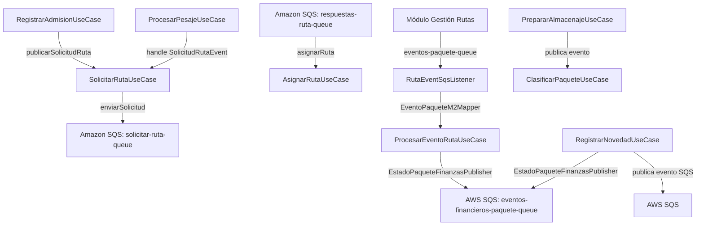

# 02 — Application Use Cases

## Mapeo de Casos de Uso

| # | Caso de Uso | Puerto Entrada | Puertos Salida Orquestados | Command/Input | Response/Output |
|---|---|---|---|---|---|
| 1 | `RegistrarAdmisionUseCase` | `RegistrarAdmisionIn.registrarAdmision()` | `GeocodingService`, `CoverageService`, `DistanceService`, `PriceCalculationService`, `PaqueteRepository`, `SolicitarRutaUseCase` + `RutaQueuePort` | `RegistroAdmisionCommand` | `UUID` (paqueteId) |
| 2 | `ProcesarPesajeUseCase` | (directo) `procesarPesaje(PesajeCommand)` | `PaqueteRepository`, `SolicitarRutaUseCase` | `PesajeCommand` | `PesajeResponse` |
| 3 | `ClasificarPaqueteUseCase` | (directo) `sugerirZonaParaPaquete()`, `confirmarClasificacion()` | `PaqueteRepository`, `ZonaDestinoRepository`, `CalculoZonaDestinoService` | UUID paqueteId + UUID zonaDestinoId | `ClasificacionSugeridaResponse` / void |
| 4 | `PrepararAlmacenajeUseCase` | `PrepararAlmacenajeIn.prepararAlmacenaje()` | `PaqueteRepository`, `ZonaAlmacenajeRepository` | `PrepararAlmacenajeCommand` | void |
| 5 | `SolicitarRutaUseCase` | (directo) `handle(SolicitudRutaEvent)` | `PaqueteRepository`, `RutaQueuePort` | `SolicitudRutaEvent` | void |
| 6 | `AsignarRutaUseCase` | (directo) `asignarRuta(AsignarRutaCommand)` | `PaqueteRepository` | `AsignarRutaCommand` | void |
| 7 | `ConsultarPaqueteUseCase` | `ConsultarPaqueteIn.consultarPaquete()` | `PaqueteRepository` | UUID paqueteId | `Optional<Paquete>` |
| 8 | `ProcesarEventoRutaUseCase` | (directo) `procesar(EventoRutaDto)` | `PaqueteRepository`, `HistorialEstadoRepository`, `EventoProcesadoRepository`, `NotificacionPort`, `EstadoPaqueteFinanzasPublisher` | `EventoRutaDto` | void |
| 9 | `RegistrarNovedadUseCase` | (directo) `registrarNovedad(RegistrarNovedadCommand)` | `PaqueteRepository`, `HistorialEstadoRepository`, `ArchivoStoragePort`, `NovedadEventPublisher`, `EstadoPaqueteFinanzasPublisher` | `RegistrarNovedadCommand` | `RegistroNovedadResponse` |

## Puertos de Salida (Interfaces del Application Layer)

### Puerto → Adaptador mapping

| Puerto | Métodos | Implementado por |
|---|---|---|
| `PaqueteRepository` | save, findById, findAll | `PaqueteJpaAdapter` |
| `ZonaAlmacenajeRepository` | save, findById, findCompatibleZonesWithCapacity, findBySedeId, findByCategoriaAndSedeId | `ZonaAlmacenajeJpaAdapter` |
| `ZonaDestinoRepository` | findById, findAllActivas, save, findBySedeId | `ZonaDestinoJpaAdapter` |
| `UsuarioRepository` | save, findById, findByUsername, existsByUsername | `UsuarioJpaAdapter` |
| `HistorialEstadoRepository` | guardar, obtenerHistorialPorPaqueteId | `HistorialEstadoJpaAdapter` |
| `EventoProcesadoRepository` | guardar, yaFueProcesado, buscarPorEventoId | `EventoProcesadoJpaAdapter` |
| `GeocodingService` (app.repository) | localizar(Direccion) | `GoogleMapsAdapter` |
| `CoverageService` | isWithinCoverage(Coordenadas) | `CoverageAreaAdapter` |
| `DistanceService` | calcularDistanciaKm, calcularDistanciaDesdeSede | `DistanceCalculatorAdapter` |
| `PriceCalculationService` | calculatePrice(Paquete) | `PriceCalculationServiceImpl` |
| `ArchivoStoragePort` | guardar(carpeta, identificador, MultipartFile) | `S3ArchivoStorageAdapter` |
| `RutaQueuePort` | enviarSolicitud(Paquete) | `RutaSqsAdapter` |
| ~~`RutaEventPublisher` (app.repository)~~ | ~~publicarSolicitudRuta(UUID)~~ | ~~`RutaEventAdapter` — ❌ Eliminado~~ |
| `NovedadEventPublisher` | publicarNovedadRegistrada(UUID, UUID) | `NovedadEventAdapter` |
| `EstadoPaqueteFinanzasPublisher` | publicarEstadoFinal(Paquete) | `FinanzasEventSqsAdapter` |
| `NotificacionPort` | enviarSms, enviarEmail, enviar | `MockNotificacionAdapter` |
| `ClasificacionEventPublisher` | publicarPaqueteListoParaClasificar(UUID) | (sin impl visible) |
| `GeocodingService` (app.ports) | localizar(String) | `GoogleMapsAdapter` (también implementa este) |
| ~~`RutaEventPublisher` (app.repository)~~ | ~~publicarSolicitudRuta(UUID)~~ | ~~`RutaEventAdapter` — ❌ Eliminado~~ |

## Flujo Lógico Detallado por Use Case

### UC-1: RegistrarAdmisionUseCase
```
1. Validar comando → construir objetos de dominio
2. Geocodificar dirección destino (GoogleMapsAdapter)
   └── Si coordenadasManuales presentes, úsalas directamente
3. Verificar cobertura geográfica (CoverageAreaAdapter)
   └── Si fuera de cobertura → InvalidCoverageException
4. Crear Paquete con builder + prePersist()
5. Asignar coordenadas al paquete
6. Si incluye datos de pesaje (peso, dimensiones):
   a. Crear Peso y Dimensiones (validación en VOs)
   b. procesarPesaje() → cálculos volumen, peso volumétrico, facturable
   c. Calcular distancia desde sede (DistanceService)
   d. Calcular precio (PriceCalculationService)
7. Guardar paquete (PaqueteRepository)
8. Si incluye pesaje → publicarSolicitudRuta() (evento)
9. Retornar UUID del paquete creado
```

### UC-2: ProcesarPesajeUseCase
```
1. Buscar paquete por ID → PaqueteNotFoundException si no existe
2. paquete.procesarPesaje(peso, dimensiones, tipoMercancia, irregular)
   └── Valida Peso y Dimensiones (VOs)
   └── Calcula volumen, peso volumétrico, peso facturable, categoría carga
   └── Verifica densidad atípica
3. paquete.calcularPrecioEnvio(tarifas)
4. Guardar paquete actualizado
5. Disparar SolicitudRutaEvent → delegar a SolicitarRutaUseCase
6. Construir y retornar PesajeResponse
```

### UC-3: ClasificarPaqueteUseCase
```
=== sugerirZonaParaPaquete() ===
1. Buscar paquete por ID
2. calculoZonaService.calcularZona(paquete)
   └── Obtener coordenadas del paquete
   └── findAllActivas() del ZonaDestinoRepository
   └── Filtrar por contieneCoordenas()
   └── ZonaDestinoNoEncontradaException si no hay match
3. Retornar ClasificacionSugeridaResponse

=== confirmarClasificacion() ===
1. Buscar paquete y zona de destino
2. Validar compatibilidad (zona.esAptaPara) → ZonaNoAptaException
3. Validar capacidad (zona.tieneCapacidadDisponible) → ZonaDestinoSaturadaException
4. paquete.asignarZonaDestino(zonaId) → estado LISTO_PARA_DESPACHO
5. zona.incrementarContador()
6. Guardar paquete y zona
```

### UC-4: PrepararAlmacenajeUseCase
```
1. Buscar paquete y zona de almacenaje
2. Validar compatibilidad (zona.puedeAlbergar) → ZonaIncompatibleException
3. Validar capacidad (zona.tieneCapacidadPara) → ZonaSaturadaException
4. paquete.asignarZonaAlmacenamiento(zonaId) → estado EN_CLASIFICACION
5. zona.agregarPaquete(paquete) → actualiza contadores y estado
6. Guardar paquete y zona
```

### UC-5: SolicitarRutaUseCase
```
1. Buscar paquete por ID
2. Construir SolicitudRutaPayload.from(paquete)
3. rutaQueuePort.enviarSolicitud(payload) → SQS async
```

### UC-6: AsignarRutaUseCase
```
1. Recibir AsignarRutaCommand (paqueteId, rutaId, fechaHoraEvento)
2. Buscar paquete por ID → PaqueteNotFoundException
3. paquete.asignarRuta(rutaId) → LISTO_PARA_DESPACHO
4. Guardar paquete
```

### UC-7: ConsultarPaqueteUseCase
```
1. Buscar paquete por ID
2. Retornar Optional<Paquete>
```

### UC-8: ProcesarEventoRutaUseCase

**Entrada asíncrona:** El `RutaEventSqsListener` recibe un `EventoPaqueteM2Dto` desde la cola `eventos-paquete-queue`. Jackson deserializa polimórficamente según el discriminador `tipo_evento` (`@JsonTypeInfo`). `EventoPaqueteM2Mapper` traduce los 6 tipos M2 a comandos `EventoRutaDto`:

| `tipo_evento` M2 | Mapper → `TipoEventoRuta` | Notas |
|---|---|---|
| `PAQUETE_EN_TRANSITO` | `EN_TRANSITO` | — |
| `PAQUETE_ENTREGADO` | `ENTREGADO` | `urlEvidencia` ← `evidencia.url_foto` |
| `PARADA_FALLIDA` | `DEVOLUCION` | `motivo` propagado al dominio |
| `NOVEDAD_GRAVE` | `DAÑADO` / `EXTRAVIADO` / `DEVOLUCION` | Según `tipo_novedad` |
| `PARADAS_SIN_GESTIONAR` | `DEVOLUCION` (N×, uno por paquete) | Itera lista interna |
| `PAQUETE_EXCLUIDO_DESPACHO` | `DEVOLUCION` | — |

```
1. Verificar idempotencia (EventoProcesadoRepository.yaFueProcesado)
   └── EventoDuplicadoException si ya existe
2. Buscar paquete por ID
3. Procesar según tipo de evento:
   └── EN_TRANSITO → transitarAEnRuta()
   └── EN_PARADA_DE_ENTREGA → transitarAParadaDeEntrega()
   └── ENTREGADO → entregarPaquete()
   └── DEVOLUCION → registrarDevolucionEnRuta()
   └── EXTRAVIADO → registrarExtraviadoEnRuta()
   └── DAÑADO → registrarDañadoEnRuta()
4. Guardar paquete actualizado
5. Guardar historial de estado
6. Marcar evento como procesado
7. Enviar notificaciones (SMS a remitente, SMS+Email a destinatario)
8. Si el estado es final (ENTREGADO, DEVOLUCION, DAÑADO, EXTRAVIADO):
   └── Publicar evento asíncrono a Finanzas (EstadoPaqueteFinanzasPublisher)
   └── Payload: {id_paquete, id_ruta, estado} con snake_case
   └── Si SQS falla → excepción propagada → rollback @Transactional
```

### UC-9: RegistrarNovedadUseCase
```
1. Buscar paquete por ID
2. Si hay evidencia → guardar en S3 (ArchivoStoragePort)
3. paquete.registrarNovedad(tipo, observaciones, usuarioId, urlEvidencia)
   └── Valida estados permitidos (RECIBIDO_EN_SEDE | EN_CLASIFICACION)
   └── Valida evidencia obligatoria para DAÑADO
   └── Retorna HistorialEstado
4. Guardar paquete + historial
5. Publicar evento novedad (NovedadEventPublisher → AWS SQS)
6. Publicar evento asíncrono a Finanzas (EstadoPaqueteFinanzasPublisher → SQS)
   └── Payload mínimo: {id_paquete, id_ruta, estado} con snake_case
   └── Si falla → excepción propagada → rollback transaccional (FR-006)
7. Retornar RegistroNovedadResponse
```

## Diagrama de Dependencias entre Casos de Uso



## Commands y DTOs de Aplicación

| Command/Response | Atributos |
|---|---|
| `RegistroAdmisionCommand` | sedeId, direccionDestino, valorDeclarado, metodoPago, remitente, destinatario, tipoMercancia, indicadorFormaIrregular, peso, largo, ancho, alto, coordenadasManuales |
| `PesajeCommand` | paqueteId, peso, dimensiones, tipoMercancia, formaIrregular, tarifaBase, tarifaPorKg, tarifaPorKm, recargoTipoMercancia, recargoCategoriaCarga |
| `PesajeResponse` | paqueteId, peso, volumenM3, pesoVolumetrico, pesoFacturable, categoriaCarga, precioEnvio, alertaCargaEspecial, alertaDensidadAtipica |
| `PrepararAlmacenajeCommand` | paqueteId, zonaAlmacenamientoId |
| `RegistrarNovedadCommand` | paqueteId, tipoNovedad, observaciones, usuarioId, evidencia(MultipartFile) |
| `RegistroNovedadResponse` | paqueteId, estadoActual, historialId |
| `ClasificacionSugeridaResponse` | paqueteId, zonaDestinoId, nombreZona, codigoZona |
| `EventoRutaDto` | eventoId, paqueteId, rutaId, tipoEvento, observaciones, urlEvidencia, nombreFirmante, motivo |
| `EventoFinancieroPaqueteDto` | idPaquete, idRuta, estado (snake_case via @JsonProperty) |


---

---

---

---

---

## Anexo: Estado de Archivos Actual (application)
*Generado automáticamente por sync-agent-docs.py el 2026-05-18 07:01:05 UTC*

| Indicador | Valor |
|---|---|
| Clases | 17 |
| Interfaces | 21 |
| Enumeraciones | 1 |
| Records | 3 |
| Métodos públicos (significativos) | 12 |
| Archivos analizados | 42 |

### Tipos Detectados

| Tipo | Nombre | Paquete | Métodos públicos |
|---|---|---|---|
| 🟩 Int | `ClasificacionEventPublisher` | `com.logistics.packages.application.ports` | `—` |
| 🟩 Int | `EventoProcesadoRepository` | `com.logistics.packages.application.ports` | `—` |
| 🟩 Int | `GeocodingService` | `com.logistics.packages.application.ports` | `—` |
| 🟩 Int | `NotificacionPort` | `com.logistics.packages.application.ports` | `—` |
| 🟩 Int | `RutaEventPublisher` | `com.logistics.packages.application.ports` | `—` |
| 🟩 Int | `RutaQueuePort` | `com.logistics.packages.application.ports` | `—` |
| 🟩 Int | `UsuarioRepository` | `com.logistics.packages.application.ports` | `—` |
| 🟩 Int | `ZonaDestinoRepository` | `com.logistics.packages.application.ports` | `—` |
| 🟩 Int | `ArchivoStoragePort` | `com.logistics.packages.application.repository` | `—` |
| 🟩 Int | `ConsultarPaqueteIn` | `com.logistics.packages.application.repository` | `—` |
| 🟩 Int | `CoverageService` | `com.logistics.packages.application.repository` | `—` |
| 🟩 Int | `DistanceService` | `com.logistics.packages.application.repository` | `—` |
| 🟩 Int | `GeocodingService` | `com.logistics.packages.application.repository` | `—` |
| 🟩 Int | `HistorialEstadoRepository` | `com.logistics.packages.application.repository` | `—` |
| 🟩 Int | `NovedadEventPublisher` | `com.logistics.packages.application.repository` | `—` |
| 🟩 Int | `PaqueteRepository` | `com.logistics.packages.application.repository` | `—` |
| 🟩 Int | `PrepararAlmacenajeIn` | `com.logistics.packages.application.repository` | `—` |
| 🟩 Int | `PriceCalculationService` | `com.logistics.packages.application.repository` | `—` |
| 🟦 Cls | `PriceCalculationServiceImpl` | `com.logistics.packages.application.repository` | `calculatePrice, calcularSubtotal` |
| 🟩 Int | `RegistrarAdmisionIn` | `com.logistics.packages.application.repository` | `—` |
| 🟩 Int | `RutaEventPublisher` | `com.logistics.packages.application.repository` | `—` |
| 🟩 Int | `ZonaAlmacenajeRepository` | `com.logistics.packages.application.repository` | `—` |
| 🟪 Rec | `AsignarRutaCommand` | `com.logistics.packages.application.usecase` | `—` |
| 🟦 Cls | `AsignarRutaUseCase` | `com.logistics.packages.application.usecase` | `asignarRuta` |
| 🟦 Cls | `ClasificacionSugeridaResponse` | `com.logistics.packages.application.usecase` | `—` |
| 🟦 Cls | `ClasificarPaqueteUseCase` | `com.logistics.packages.application.usecase` | `sugerirZonaParaPaquete, confirmarClasificacion` |
| 🟦 Cls | `ConsultarPaqueteUseCase` | `com.logistics.packages.application.usecase` | `—` |
| 🟨 Enm | `TipoEventoRuta` | `com.logistics.packages.application.usecase.gestionnovedad` | `—` |
| 🟦 Cls | `ProcesarEventoRutaUseCase` | `com.logistics.packages.application.usecase.gestionnovedad` | `procesar` |
| 🟦 Cls | `RegistrarNovedadCommand` | `com.logistics.packages.application.usecase.novedad` | `—` |
| 🟦 Cls | `RegistrarNovedadUseCase` | `com.logistics.packages.application.usecase.novedad` | `registrarNovedad` |
| 🟦 Cls | `RegistroNovedadResponse` | `com.logistics.packages.application.usecase.novedad` | `—` |
| 🟦 Cls | `PesajeCommand` | `com.logistics.packages.application.usecase` | `—` |
| 🟦 Cls | `PesajeResponse` | `com.logistics.packages.application.usecase` | `—` |
| 🟪 Rec | `PrepararAlmacenajeCommand` | `com.logistics.packages.application.usecase` | `—` |
| 🟦 Cls | `PrepararAlmacenajeUseCase` | `com.logistics.packages.application.usecase` | `prepararAlmacenaje` |
| 🟦 Cls | `ProcesarPesajeUseCase` | `com.logistics.packages.application.usecase` | `procesarPesaje` |
| 🟦 Cls | `RegistrarAdmisionUseCase` | `com.logistics.packages.application.usecase` | `registrarAdmision` |
| 🟪 Rec | `RegistroAdmisionCommand` | `com.logistics.packages.application.usecase` | `—` |
| 🟦 Cls | `SolicitarRutaUseCase` | `com.logistics.packages.application.usecase` | `handle` |
