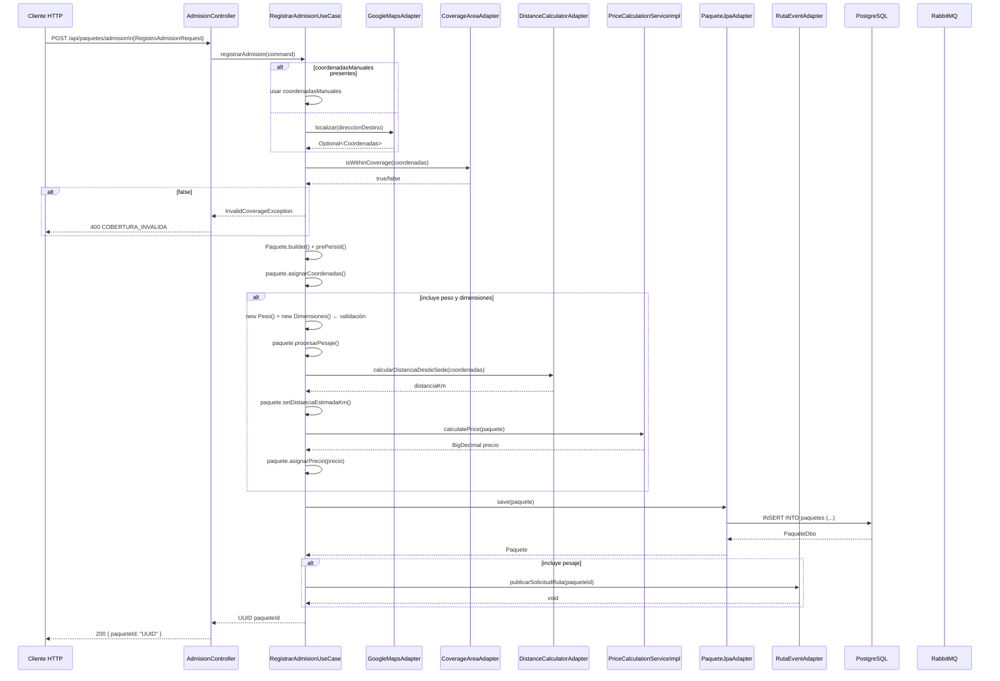
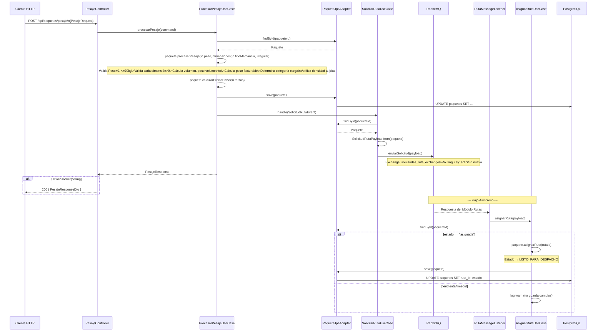
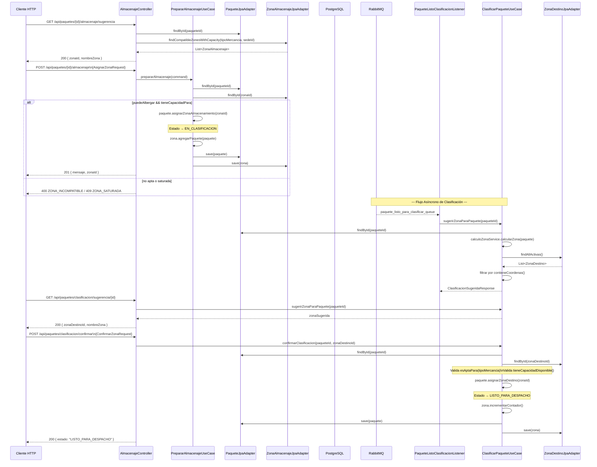
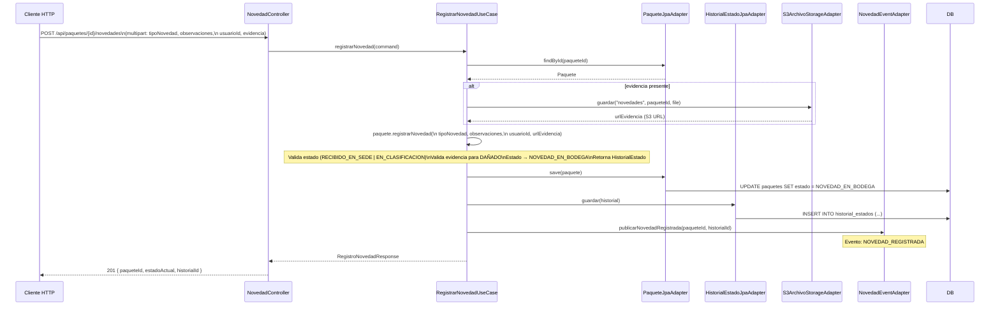
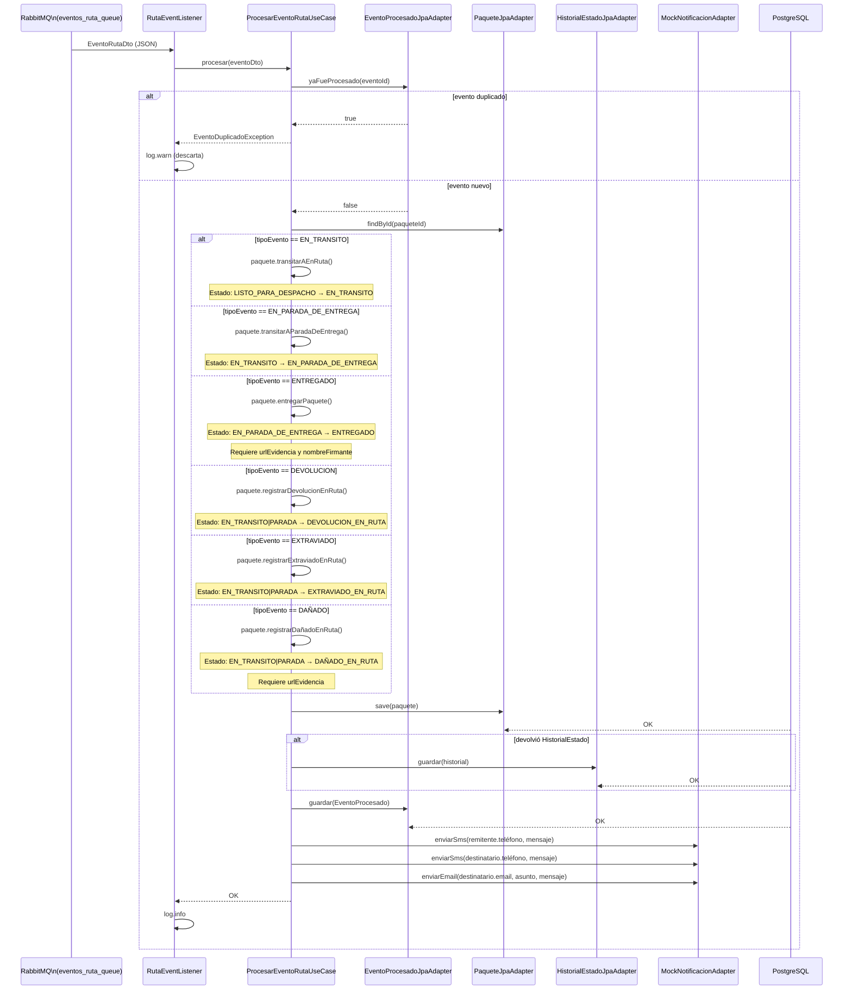
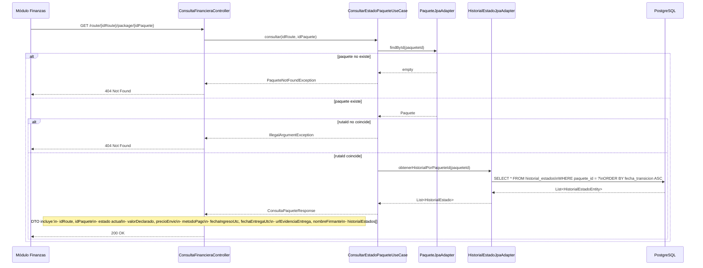

# 04 — Data Flows

## Flujo 1: Admisión Completa con Pesaje (UC-1 + UC-2 + UC-5)



## Flujo 2: Pesaje Separado con Solicitud de Ruta Asíncrona (UC-2 + UC-5 + UC-6)



## Flujo 3: Almacenaje + Clasificación por Zona de Destino (UC-4 + UC-3)



## Flujo 4: Registro de Novedad en Bodega (UC-10)



## Flujo 5: Procesamiento de Eventos de Ruta con Idempotencia (UC-9)



## Flujo 6: Consulta Financiera (UC-8)



## Mapa General de Flujo de Datos (End-to-End)

```mermaid
flowchart TD
    subgraph INPUT[Entrada]
        A1[POST /api/paquetes/admision]
        A2[POST /api/paquetes/pesaje]
        A3[POST /api/paquetes/{id}/almacenaje]
        A4[POST /api/paquetes/clasificacion/confirmar]
        A5[POST /api/paquetes/{id}/novedades]
        A6[Evento Módulo Rutas]
    end

    subgraph APP[Capa Aplicación - Use Cases]
        UC1[RegistrarAdmision]
        UC2[ProcesarPesaje]
        UC4[PrepararAlmacenaje]
        UC3[ClasificarPaquete]
        UC10[RegistrarNovedad]
        UC5[SolicitarRuta]
        UC6[AsignarRuta]
        UC9[ProcesarEventoRuta]
        UC8[ConsultarEstado]
    end

    subgraph DOMAIN[Domain Model]
        P[Paquete]
        ZA[ZonaAlmacenaje]
        ZD[ZonaDestino]
        HE[HistorialEstado]
        NOT[Notificacion]
        EP[EventoProcesado]
    end

    subgraph INFRA[Infrastructure]
        JPA[JPA Adapters\nPostgreSQL]
        MQ[RabbitMQ]
        S3[AWS S3]
        SQS[AWS SQS]
        EXT[APIs Externas\nGoogle Maps]
    end

    subgraph OUTPUT[Salida]
        R1[200 JSON Responses]
        R2[RabbitMQ Out]
        R3[S3 URLs]
    end

    A1 --> UC1
    A2 --> UC2
    A3 --> UC4
    A4 --> UC3
    A5 --> UC10
    A6 --> UC9

    UC1 --> P
    UC2 --> P
    UC4 --> P & ZA
    UC3 --> P & ZD
    UC10 --> P & HE
    UC5 --> P
    UC6 --> P
    UC9 --> P & HE & EP & NOT

    UC1 --> EXT
    UC1 --> JPA
    UC2 --> JPA
    UC4 --> JPA
    UC3 --> JPA
    UC10 --> JPA & S3
    UC9 --> JPA

    UC1 --> MQ
    UC5 --> MQ
    UC6 --> MQ
    UC9 --> MQ

    UC10 --> SQS

    JPA --> R1
    MQ --> R2
    S3 --> R3
    R1 --> UI[Frontend / Clientes API]
```
